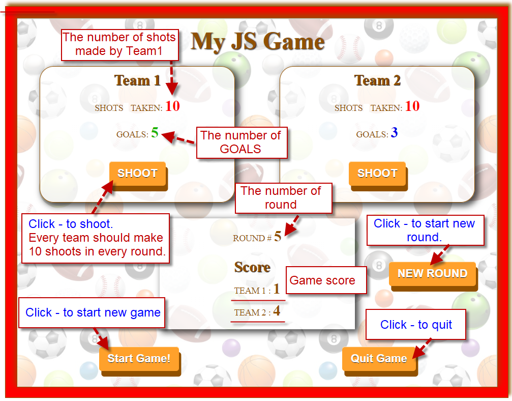

## Assessment: JS Sports Game
 

###### 1. "Start Game" button:
 * change background color for gameContainer. 
 *  sound effect  for the start of new game (*sound 1*).

###### 2. "Shoot" button:
Ten shots possible -  for every team in each round. Goals - results of successful shorts.
*  sound effect for every shot: short for team_1 (*sound 2*) and short for team_2 (*sound 3*).
*  color is changing for every new  displayed number of goals.
*  as soon as each team get the 10th shot:
      *  the color for number of goals - change to red.
      * alert: when number of shots exceed 10 and Team try to shoot more.
*  when each period completed (as soon as 20th short has made):
      * score of game is calculated and displayed.
      * sound effect for the end of period  (*sound 4*). 
 
###### 3. "New round" button:
* sound effect  for the start of new round  (*sound 5*).
*  displayed the number of round.
* resets the numbers of  shorts and goals.
* alert: when try to start new round (click the 'New Round' button) but number of shots for two teams <20.

###### 4. "Quit Game" button:
* sound effect  for the end of game  (*sound 6*).
*  result of Game is displayed: who won the game and score
*  change background color for gameContainer. 
 ================================
## Layout design
Grid Layout -  for the page.
Flexbox - for the grid areas.

